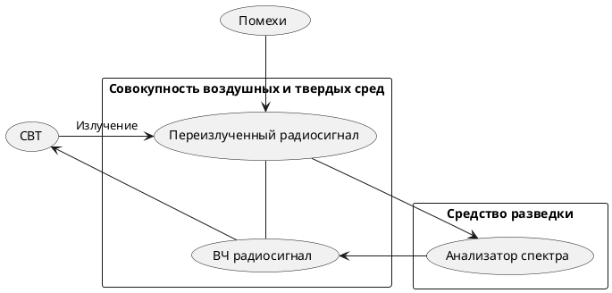

Параметрический канал утечки информации  
1.При взаимодействии облучающего электромагнитного поля с элементами ТСПИ происходит переизлучение электромагнитного поля.  
2.В ряде случаев это вторичное излучение модулируется информационным сигналом.  
При съеме информации для исключения взаимного влияния облучающего и переизлученного сигналов может использоваться их временная или частотная развязка. Например, для облучения ТСПИ могут использовать импульсные сигналы.  
3.При переизлучении параметры сигналов изменяются. Поэтому данный канал утечки информации часто называют параметрическим.  
4.Для перехвата информации по данному каналу необходимы специальные высокочастотные генераторы с антеннами, имеющими узкие диаграммы направленности и специальные радиоприемные устройства.


^89db6a


ДРУГАЯ ВЕРСИЯ

```plantuml
usecase "Источник\nакустических\nколебаний" as SOURCE
rectangle "Воздушная среда" {
usecase "Акустические\nколебания" as AKUSTKOLEB
    SOURCE -right-> AKUSTKOLEB
}
rectangle "Твердая среда\nc(без) проводником(-а)" {
    usecase "Механические\nколебания" as MECHKOLEB
    AKUSTKOLEB -right-> MECHKOLEB : Воздействие\nна объект
}
rectangle "Воздушная среда\n" {
    usecase "ЭМИ" as EMI
    MECHKOLEB -right-> EMI : Изменение частоты\nрезонанса объекта
}
rectangle "Средство разведки" {
    usecase "Анализатор\nспектра" as AS
    usecase "ВЧ\nгенератор" as HFGEN
    usecase "Антенна\n(излучающая)" as TX
    usecase "Антенна\n(приемная)" as RX
    HFGEN -[#red]up-> TX
    EMI <-[#red]- TX : Облучающие\n**ВЧ колебания**
    AS <-[#blue]up- RX
    EMI -[#blue]-> RX : Промодули-\nрованные \n**ВЧ колебания**
}
usecase "Помехи" as POMEHI1
POMEHI1 -up-> EMI
usecase "Помехи" as POMEHI2
POMEHI2 -up-> MECHKOLEB
usecase "Помехи" as POMEHI3
POMEHI3 -up-> AKUSTKOLEB
```

Физический принцип канала утечки информации.
>В результате воздействия акустического поля меняется давление на все элементы высокочастотных генераторов ТСПИ и ВТСС. При этом изменяется (незначительно) взаимное расположение элементов схем, проводов в катушках индуктивности, дросселей и т. п., что может привести к изменениям параметров высокочастотного сигнала, например, к модуляции его информационным сигналом. Поэтому этот канал утечки информации называется параметрическим. Это обусловлено тем, что незначительное изменение взаимного расположения, например, проводов в катушках индуктивности (межвиткового расстояния) приводит к изменению их индуктивности, а, следовательно, к изменению частоты излучения генератора, т.е. к частотной модуляции сигнала. Или воздействие акустического поля на конденсаторы приводит к изменению расстояния между пластинами и, следовательно, к изменению его емкости, что, в свою очередь, также приводит к частотной модуляции высокочастотного сигнала генератора. Наиболее часто наблюдается паразитная модуляция информационным сигналом излучений гетеродинов радиоприемных и телевизионных устройств, находящихся в выделенных помещениях и имеющих конденсаторы переменной емкости с воздушным диэлектриком в колебательных контурах гетеродинов. Промодулированные информационным сигналом высокочастотные колебания излучаются в окружающее пространство и могут быть перехвачены и детектированы средствами радиоразведки. Параметрический канал утечки информации может быть реализован и путем "высокочастотного облучения" помещения, где установлены полуактивные закладные устройства, имеющие элементы, некоторые параметры которых (например, добротность и резонансная частота объемного резонатора) изменяются по закону изменения акустического (речевого) сигнала. При облучении мощным высокочастотным сигналом помещения, в котором установлено такое закладное устройство, в последнем при взаимодействии облучающего электромагнитного поля со специальными элементами закладки (например, четвертьволновым вибратором) происходит образование вторичных радиоволн, т.е. переизлучение электромагнитного поля. А специальное устройство закладки (например, объемный резонатор) обеспечивает амплитудную, фазовую или частотную модуляцию переотраженного сигнала по закону изменения речевого сигнала. Подобного вида закладки иногда называют полуактивными. Для перехвата информации по данному каналу кроме закладного устройства необходимы специальный передатчик с направленным излучением и приемник.
>c.21[^1] 

[[Основные параметры и критерии защищенности ВЧО каналов]]


[^1]:[[Хорев А.А. ЗАЩИТА ИНФОРМАЦИИ ОТ УТЕЧКИ ПО ТЕХНИЧЕСКИМ КАНАЛАМ — Москва 1998]]
