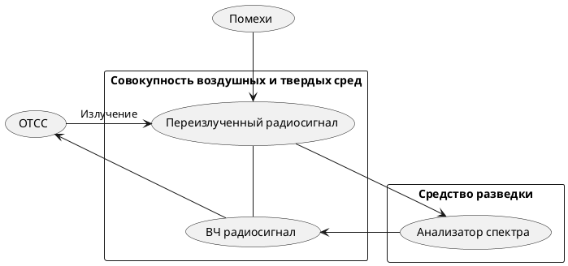

Параметрический канал утечки информации  
1.При взаимодействии облучающего электромагнитного поля с элементами ТСПИ происходит переизлучение электромагнитного поля.  
2.В ряде случаев это вторичное излучение модулируется информационным сигналом.  
При съеме информации для исключения взаимного влияния облучающего и переизлученного сигналов может использоваться их временная или частотная развязка. Например, для облучения ТСПИ могут использовать импульсные сигналы.  
3.При переизлучении параметры сигналов изменяются. Поэтому данный канал утечки информации часто называют параметрическим.  
4.Для перехвата информации по данному каналу необходимы специальные высокочастотные генераторы с антеннами, имеющими узкие диаграммы направленности и специальные радиоприемные устройства.

^89db6a

