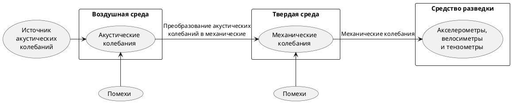

>Источниками акустических сигналов могут быть разговаривающие люди, механизмы, приборы, устройства и средства, воспроизводящие ранее записанные звуковые сигналы.
>[[Акустическая волна|Акустические волны]] как носители информации характеризуются рядом параметров, особенностей и свойств. Физическая сущность их имеет много общего с соответствующими характеристиками и явлениями при распространении акустических волн в водной среде.
>Для перехвата акустических сигналов по вибрационному каналу утечки используют контактные микрофоны. Контактные микрофоны, соединенные с электронным усилителем, называются [[Электронным стетоскопом|электронными стетоскопами]].
>По вибрационному каналу возможен также перехват информации с использованием закладных устройств. Для передачи информации в этом случае используется радиоканал, поэтому такие устройства часто называют радиостетоскопами.
>Возможно использование закладных устройств с передачей информации по оптическому, а также по ультразвуковому каналам (по металлоконструкциям зданий).
>c.286[^3]

[^3]:[[Меньшаков Ю.К. Теоретические основы технических разведок. 2008]]