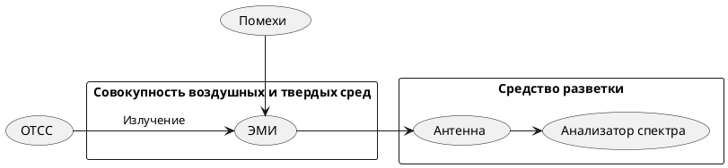

# Канал утечки [[ПЭМИ]] (за счет собственно ЭМИ)

^00da36

>В ТСПИ носителем информации является электрический ток, параметры которого (сила тока, напряжение, частота и фаза) изменяются по закону информационного сигнала. При прохождении электрического тока по токоведущим элементам ТСПИ вокруг них (в окружающем пространстве) возникает электрическое и магнитное поле. В силу этого элементы ТСПИ можно рассматривать как излучатели электромагнитного поля, модулированного по закону изменения информационного сигнала.
с. 7[^1]

Основная характеристика канала - [[Зона ЭМИ]]

[[Критерий защищенности от ПЭМИ (засчет собственно ЭМИ)]]

[[Методика проведения СИ ПЭМИ]]

[^1]:[[Хорев А.А. Техническая защита информации учеб. пособие для студентов вузов. В 3 т. Т. 1. Технические каналы утечки информации. М. НПЦ Аналитика, 2008. 436 с.]]
