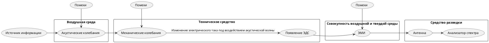

```plantuml
@startuml
usecase "Источник информации" as Istochnicinformaci
rectangle "Воздушная среда" {
	usecase "Акустические колебания" as Acustickolebania
}
Istochnicinformaci -> (Acustickolebania)
rectangle "Техническое средство" {
	usecase "Механические колебания" as mechanickolebania
	usecase "Появление ЭДС" as EDS
	mechanickolebania -> (EDS) : Изменение электрического тока под воздействием акустической волны
}
Acustickolebania -> (mechanickolebania)
rectangle "Совокупность воздушной и твердой среды" {
	usecase "ЭМИ" as EMI
}
EDS -> (EMI)
rectangle "Средство разведки" {
	usecase "Антенна" as Antenna
	Antenna-> (Analizatorspektra)
	usecase "Анализатор спектра" as Analizatorspektra
}
EMI -> (Antenna)
usecase "Помехи" as PomehiEMI
PomehiEMI -down-> EMI
usecase "Помехи" as Pomehiacustica
Pomehiacustica -down-> Acustickolebania
usecase "Помехи" as Pomehimechanickoleb
Pomehimechanickoleb -down-> mechanickolebania
@enduml
```

Критерий защищенности - [[Критерий защищенности от ПЭМИ (засчет собственно ЭМИ)]]

Параметр -[[Зона ЭМИ]]

Физический принцип - [[ПЭМИ]]