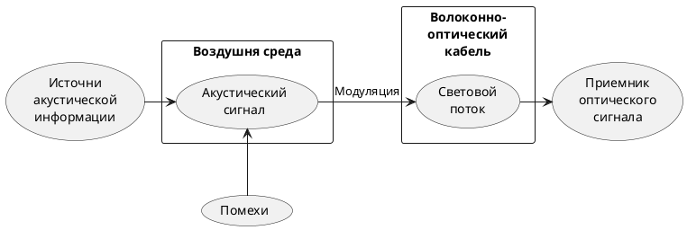

>Акусто-оптоволоконный канал связан с несанкционированным съѐмом речевой информации (подслушиванием) через штатные волоконно-оптические каналы передачи информации различного назначения данного учреждения. В канале утечки акустическое поле от носителя информации воздействует на оптоволокно штатных информационных систем, построенных на волоконнооптических технологиях, и вызывает модуляцию светового потока в оптоволокне или сетевом оборудовании на акустических частотах. 
>Световой поток может быть сформирован как штатным оборудованием, так и специально создан нарушителем. Промодулированный речью световой поток по штатным волоконно-оптическим коммуникациям может выйти далеко за пределы места переговоров, где может быть демодулирован и зарегистрирован злоумышленником. Расстояния распространения сигнала могут достигать сотен километров в зависимости от структуры кабельной сети, что связано с малым затуханием оптического сигнала в оптоволокне.
>Также для съема речевой информации могут быть использованы переменные по интенсивности световые потоки, применяемые для синхронизации на физическом уровне работы приемопередающего активного оборудования и действующие между передачей данных. К нештатным потокам относятся любые излучения, формируемые источниками света, несанкционированно подключенными к волоконно-оптическим коммуникациям.
>c.99[^5]

[^5]:[[Жаркова М. В., Чекулаева Е. Н. Описание акусто-оптоволоконного канала утечки информации в работе по защите информации.]]