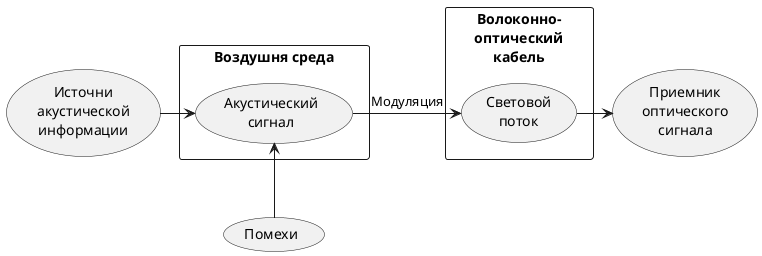

>Акусто-оптоволоконный канал связан с несанкционированным съѐмом речевой информации (подслушиванием) через штатные волоконно-оптические каналы передачи информации различного назначения данного учреждения. В канале утечки акустическое поле от носителя информации воздействует на оптоволокно штатных информационных систем, построенных на волоконнооптических технологиях, и вызывает модуляцию светового потока в оптоволокне или сетевом оборудовании на акустических частотах. 
>Световой поток может быть сформирован как штатным оборудованием, так и специально создан нарушителем. Промодулированный речью световой поток по штатным волоконно-оптическим коммуникациям может выйти далеко за пределы места переговоров, где может быть демодулирован и зарегистрирован злоумышленником. Расстояния распространения сигнала могут достигать сотен километров в зависимости от структуры кабельной сети, что связано с малым затуханием оптического сигнала в оптоволокне.
>Также для съема речевой информации могут быть использованы переменные по интенсивности световые потоки, применяемые для синхронизации на физическом уровне работы приемопередающего активного оборудования и действующие между передачей данных. К нештатным потокам относятся любые излучения, формируемые источниками света, несанкционированно подключенными к волоконно-оптическим коммуникациям.
>c.99[^5]

>Оптические преобразователи лежат в основе акустооптического канала утечки информации, использующего акустооптический эффект.
>Суть акустооптического эффекта связана с влиянием упругих деформаций стеклянных отражающих поверхностей или волоконно-оптических кабелей на количественные показатели отражения, преломления или рассеяния электромагнитных волн оптического диапазона. Причиной деформаций, в помещении с ведущимися переговорами, выступает акустическое речевое воздействие. Акустическое воздействие на волоконно-оптический кабель приводит к модуляции интенсивности потока электромагнитных колебаний параметрами акустического воздействия, т. е. в частности – речи. Изменение интенсивности потока электромагнитных колебаний оптического диапазона в волоконно-оптическом кабеле под действием деформаций обусловлено особенностями распространения оптических волн вдоль кабеля. В сущности, волоконно-оптический кабель является волноводом. В основе конструкции волоконно-оптического кабеля лежит волоконный световод из тонкого стеклянного волокна. Волоконный световод не является однородным и содержит как минимум два кольцевых слоя (сердцевину и оболочку) с различными показателями преломления. Электромагнитная распространяется по сердцевине в т. ч. за счет отражения ее от границ сердечника и оболочки. Создание оптимальных условий для отражения электромагнитных оптических колебаний на границе сердцевина-оболочка и защита от излучения в окружающее пространство является основным предназначением оболочки. То есть передача световой энергии происходит волноводным методом посредством многократного отражения электромагнитной волны от границы раздела сред. Вполне очевидно, что изменение геометрических размеров (толщины) световода под воздействием акустических колебаний взывает изменение пути движения электромагнитной волны и, следовательно, к изменению интенсивности, причем пропорционально акустическим колебаниям.
>В сущности, волоконно-оптические кабели как преобразователи механического давления в изменение интенсивности света являются причиной и источником «микрофонный эффекта».
>c. 76-77[^6]

[^5]:[[Жаркова М. В., Чекулаева Е. Н. Описание акусто-оптоволоконного канала утечки информации в работе по защите информации.]]
[^6]:[[Сидак А.А., Василенко В.В., Рыженко С.В. Информационная безопасность. Физические основы технических каналов утечки информации. DirectMedia Москва 2022]]