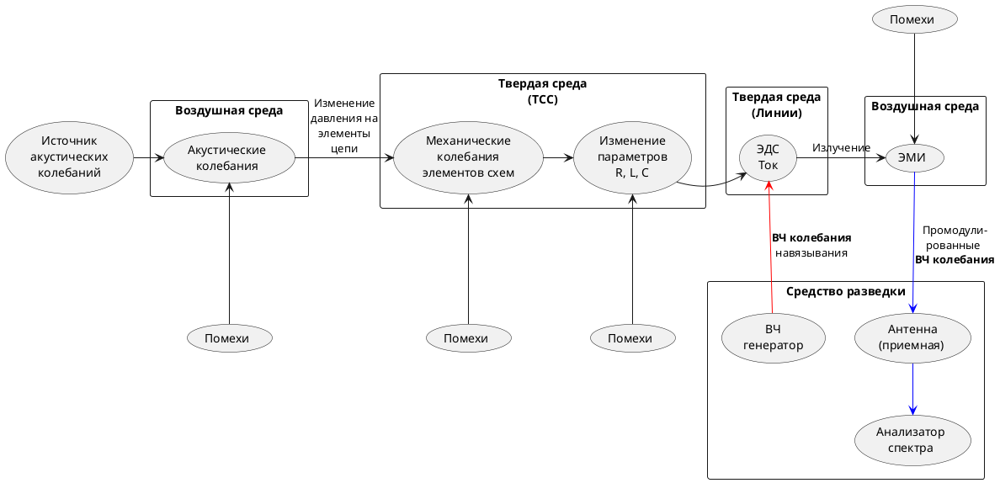

```plantuml
@startuml
usecase "Источник\nакустических\nколебаний" as Istochnik
rectangle "Воздушная среда" {
usecase "Акустические\nколебания" as AkustKoleb
Istochnik -right-> AkustKoleb
}
rectangle "Твердая среда\n(ТСС)" {
	usecase "Механические\nколебания\nэлементов схем" as MechKoleb
	usecase "Изменение\nпараметров\nR, L, C" as IzmenParam
	AkustKoleb -right-> MechKoleb : Изменение\nдавления на\nэлементы\nцепи
	MechKoleb -right-> IzmenParam
}
rectangle "Твердая среда\n(Линии)" {
	usecase "ЭДС\nТок" as EDS
}
IzmenParam -right-> EDS
rectangle "Воздушная среда\n" {
	usecase "ЭМИ" as Emi
	EDS -right-> Emi : Излучение
}
rectangle "Средство разведки" {
	usecase "Анализатор\nспектра" as AS
	usecase "ВЧ\nгенератор" as Generator
	usecase "Антенна\n(приемная) " as AntennaPriem
	EDS <-[#red]up- Generator : **ВЧ колебания**\nнавязывания
	AS <-[#blue]up- AntennaPriem
	Emi -[#blue]-> AntennaPriem : Промодули-\nрованные \n**ВЧ колебания**
}
usecase "Помехи" as Pomehi1
Pomehi1 -up-> MechKoleb
usecase "Помехи" as Pomehi2
Pomehi2 -up-> AkustKoleb
usecase "Помехи" as Pomehi3
Pomehi3 -up-> IzmenParam
usecase "Помехи" as Pomehi4
Pomehi4 -down-> Emi
@enduml
```
Физический принцип - [[Высокочастотное навязывание]]
[[Параметр защищенности для канала ВЧН не нормирован]]
