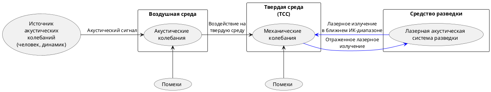

>Оптико-электронный (лазерный) канал утечки акустической информации образуется при облучении лазерным лучом вибрирующих в акустическом поле тонких отражающих поверхностей (стекол окон, картин, зеркал и т.д.). Отраженное лазерное излучение (диффузное или зеркальное) модулируется по амплитуде и фазе (по закону вибрации поверхности) и принимается приемником оптического (лазерного) излучения, при демодуляции которого выделяется речевая информация. Причем лазер и приемник оптического излучения могут быть установлены в одном или разных местах (помещениях). Для перехвата речевой информации по данному каналу используются сложные лазерные акустические локационные системы, иногда называемые "лазерными микрофонами". Работают они, как правило, в ближнем инфракрасном диапазоне волн. [^1]

>Оптические преобразователи лежат в основе акустооптического канала утечки информации, использующего акустооптический эффект. 
>Суть акустооптического эффекта связана с влиянием упругих деформаций стеклянных отражающих поверхностей или волоконно-оптических кабелей на количественные показатели отражения, преломления или рассеяния электромагнитных волн оптического диапазона. Причиной деформаций, например волоконно-оптических кабелей при их размещении в помещении с ведущимися переговорами, выступает акустическое речевое воздействие. Акустическое воздейстивействие на волоконо-оптический кабель приводит к модуляции инфтенсивности потока электромагнитных колебаний параметрами акустического воздействия, т. е. в часности - речи. Изменение интенсивности потока электромагнитных колебаний оптического диапазона в волоконно-оптическом кабеле под воздействием деформаций обусловлено особенностями распространения оптических волн вдоль кабеля. В сущности, волоконно-оптический  кабель является волноводом. В основе конструкции волоконно-оптического каблеля лежит волоконный световод из тонкого стеклянного волокна. Волоконный световод не является однородным и содержит как минимум 2 кольцевых слоя (сердцевину и оболочку) с различными показателями преломления. Электромагнитная энергия распространяется по сердцевине в т. ч. за счет отражений ее от границ сердечника и оболочки. Создание оптимальных условий для отражения электромагнитных оптических колебаний на границе сердцевина-оболочка и защита от излучения в окружающее пространство является основным предназначением оболочки. То есть передача световой энергии  происходит волноводным методом посредством многократного отражения электромагнитной волны от границы раздела сред. Вполне очевидно, что изменение геометрических размеров (толщины) световода под воздействием акустических колебаний вызывает изменение пути движения электромагнитной волны и, следовательно, к изменению интенсивности, причем пропорционально акустическим колебаниям.
><...>
>В сущности, волоконно-оптические кабели как преобразователи механического давления в изменения интенсивности света являются причиной и источником "[[Микрофонный эффект|микрофонного эффекта]]".
>Кроме того, эффект модуляции электромагнитных колебаний оптического диапазона акустическими полями возможен и в результате некачественного (слабого) закрепления оптических волокон в разъемном соединителе световодов. В таких условиях акустические колебания вызывают смещение соединяемых концов световодов относительно друг друга и вознкает амплитудная модуляция излучения, проходящего по оптоволокну.
>с.76-77[^2]

Критерий защищенности - [[Защита от ОЭР ТКУИ]]
Физический принцип - [[Возможность прослушивания ЛАСР]]

[^1]:[[Хорев А. А. Технические каналы утечки акустической (речевой) информации. Специальная техника. – 2009. – №. 5.]]
[^2]:[[Сидак А.А., Василенко В.В., Рыженко С.В. Информационная безопасность. Физические основы технических каналов утечки информации. DirectMedia Москва 2022]]

