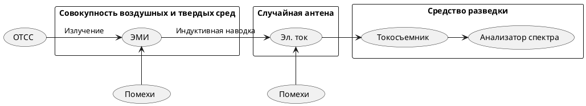

^acef4f

>Канал [[Случайная антенна|случайных антенн]], возникающий за счет наведенных ЭДС в токопроводящих коммуникациях, гальванически не связанных с СОИ и имеющих выход за пределы контролируемой зоны;
>с. 104[^1]

[^1]:[[Бузов Г. А., Калинин С. В., Кондратьев А. В. Защита от утечки информации по техническим каналам. – 2005.]]