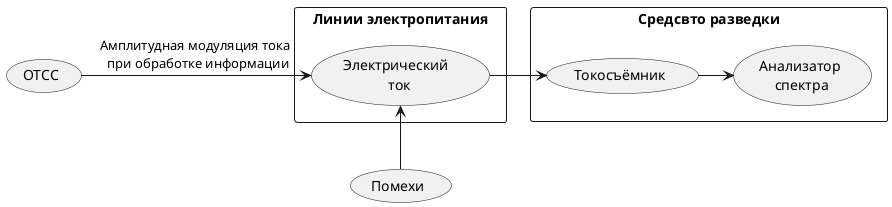

>Канал неравномерного потребления тока ([[НПТ]]) образуется за счет амплитудной модуляции тока срабатыванием элементов [[СОИ]] при обработке информации.
Канал неравномерного потребления тока из сети электропитания, образующийся   за счет   амплитудной   модуляции потребляемого тока, вызванной срабатыванием электромеханических элементов средств обработки конфиденциальной информации при прохождении через них электрических сигналов. Канал характерен для электромеханических устройств с низкой тактовой частотой (не более 1,2 кГц). Перехват осуществляется посредством подключения за пределами охраняемой территории к проводам электропитания таких средств обработки информации специальной приемной аппаратуры с помощью согласующих устройств.
>с. 104[^2]

^1fce9d

Основная характеристика и критерий защищенности канала - [[Неравномерность потребления тока]]
