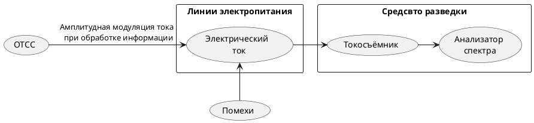

>Канал неравномерного потребления тока ([[НПТ]]) образуется за счет амплитудной модуляции тока срабатыванием элементов [[СОИ]] при обработке информации.
Канал неравномерного потребления тока из сети электропитания, образующийся   за счет   амплитудной   модуляции потребляемого тока, вызванной срабатыванием электромеханических элементов средств обработки конфиденциальной информации при прохождении через них электрических сигналов. Канал характерен для электромеханических устройств с низкой тактовой частотой (не более 1,2 кГц). Перехват осуществляется посредством подключения за пределами охраняемой территории к проводам электропитания таких средств обработки информации специальной приемной аппаратуры с помощью согласующих устройств.
>с. 104[^2]
>Канал [[НПТ]] характеризуется [[Предельное допустимое значение отношения величины изменения тока к средней величине потребления тока|предельно допустимым значением отношения величины изменения тока, поступающего от источника при обработке информации, к средней величине тока потребления]]. Если [[Предельное допустимое значение отношения величины изменения тока к средней величине потребления тока не должно превышать нормированное значение|указанное отношение не превышает предельного значения]], эффективный прием по каналу [[НПТ]] невозможен. В настоящее время, с учетом практического отсутствия в составе [[СВТ]] низкоскоростных устройств (диапазон частот этого канала принимается от 0 до 30 Гц), этот канал мало актуален.
>c.104[^2]

[^2]:[[Бузов, Калинин, Кондратьев, Защита от утечки информации по техническим каналам]]

^1fce9d

