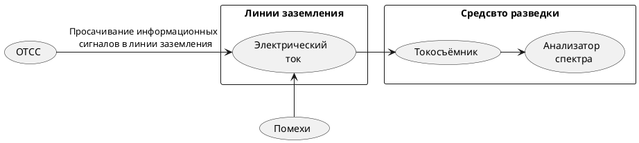

   >Просачивание информационных сигналов в цепи заземления. Кроме заземляющих проводников, служащих для непосредственного соединения ТСПИ с контуром заземления, гальваническую связь с землей могут иметь различные проводники, выходящие за пределы контролируемой зоны. К ним относятся нулевой провод сети электропитания, экраны соединительных кабелей, металлические трубы систем отопления и водоснабжения, металлическая арматура железобетонных конструкций и т.д. Все эти проводники совместно с заземляющим устройством образуют разветвленную систему заземления, в которую могут просачиваться информационные сигналы.
Перехват информационных сигналов возможен путем непосредственного подключения к соединительным линиям ВТСС и посторонним проводникам, проходящим через помещения, где установлены ТСПИ, а также к их системам электропитания и заземления.
>c.6[^2]

^84310c

Основная характеристика канала - 
>Канал отходящих коммуникаций характеризуется [[Предельно допустимое значение отношения мощностей информативного сигнала и нормированной помехи|предельно допустимым значением отношения мощностей информативного сигнала и нормированной помехи]], при котором невозможен эффективный прием.
>c.104[^2]

Критерий защищенности - [[Отношение мощностей информативного сигнала нормированной помехи во всех отходящих коммуникациях на границе КЗ не превышает предельно допустимую величину]]

[^2]:[[Бузов, Калинин, Кондратьев, Защита от утечки информации по техническим каналам]]