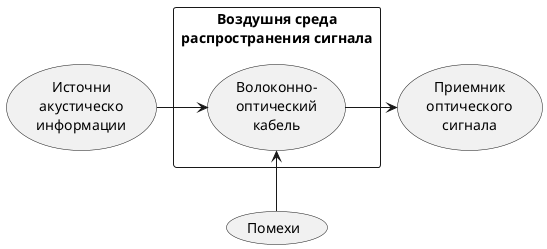

Статья - https://www.securitylab.ru/news/533072.php. Нужно найти научную работу источник и вставить сюда.

>Акусто-оптоволоконный канал связан с несанкционированным съѐмом речевой информации (подслушиванием) через штатные волоконно-оптические каналы передачи информации различного назначения данного учреждения. В канале утечки акустическое поле от носителя информации воздействует на оптоволокно штатных информационных систем, построенных на волоконнооптических технологиях, и вызывает модуляцию светового потока в оптоволокне или сетевом оборудовании на акустических частотах. 
>c.99[^5]

[^5]:[[Жаркова М. В., Чекулаева Е. Н. Описание акусто-оптоволоконного канала утечки информации в работе по защите информации.]]