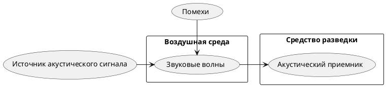

```plantuml
@startuml
usecase "Источник акустического сигнала" as A
rectangle "Воздушная среда" {
    usecase "Звуковые волны" as B
}
usecase "Помехи" as D
D -down-> B
A -> B
rectangle "Средство разведки" {
usecase "Акустический приемник" as C
}
B -> C
@enduml
```

^66d4b6

[^1]:[[Хорев А.А. Техническая защита информации учеб. пособие для студентов вузов. В 3 т. Т. 1. Технические каналы утечки информации. М. НПЦ Аналитика, 2008. 436 с.]]