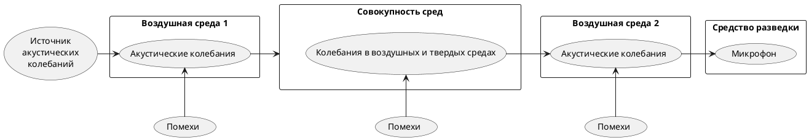

>Для перехвата речевой информации при распространении акустических сигналов через воздушную среду используют миниатюрные высокочувствительные микрофоны, которые могут объединяться с портативными звукозаписывающими устройствами (диктофонами) или миниатюрными специальными передатчиками.
>Автономные устройства, конструкционно объединяющие миниатюрные микрофоны и передатчики, называют закладными устройствами перехвата речевой информации, или акустическими закладками.
>Перехваченная закладными устройствами речевая информация может передаваться по радиоканалу, оптическому каналу, сети переменного тока, соединительным линиям вспомогательных технических средств и систем, посторонним проводникам (трубам водоснабжения и канализации, металлоконструкциям).
>Информация, передаваемая закладными устройствами, принимается, как правило, специальными устройствами. Однако встречаются устройства, информация с которых принимается с обычного телефонного аппарата. Такие устройства устанавливают или непосредственно в корпусе телефонного аппарата, находящегося в контролируемом помещении, или подключают к телефонной линии, чаще всего розетке. Подобные устройства конструкционно объединяет миниатюрный микрофон и специальный блок коммутации. Блок коммутации подключает микрофон к телефонной линии при дозвоне или подаче в линию специального кодированного сигнала.
>Использование портативных диктофонов и акустических закладок требует проникновения на контролируемый объект (в помещение). В том случае, когда это не удается, для перехвата речевой информации используют направленные микрофоны.
>c.283[^3]

[[Методика оценки защищенности помещений]]

[^3]:[[Меньшаков Ю.К. Теоретические основы технических разведок. 2008]]
