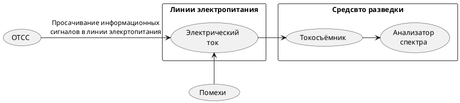

>Просачивание информационных сигналов в линии электропитания возможно при наличии магнитных связей между выходным трансформатором усилителя (например, УНЧ) и трансформатором блока питания. Кроме того, токи усиливаемых информационных сигналов замыкаются через источник электропитания, создавая на его внутреннем сопротивлении дополнительное напряжение, которое может быть обнаружено в линии электропитания. Информационный сигнал может проникнуть в линию электропитания также в результате того, что среднее значение потребляемого тока в оконечных каскадах усилителей зависит от амплитуды информационного сигнала, что создает неравномерную нагрузку на выпрямитель и приводит к изменению потребляемого тока по закону изменения информационного сигнала.
>c.6[^2]

^c7b80f

Основная характеристика канала - 
>Канал отходящих коммуникаций характеризуется предельно допустимым значением отношения мощностей информативного сигнала и нормированной помехи, при котором невозможен эффективный прием.
>c. 104[^2]

[[Критерий защищенности канала утечки информации по цепям электропитания]]

[^2]:[[Бузов, Калинин, Кондратьев, Защита от утечки информации по техническим каналам]]
